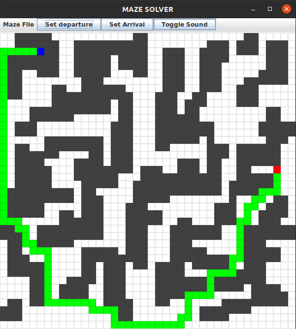

# Graphical Maze Solver/Generator



## Presentation

This java project is a graphical application designed to display and solve rectangular mazes.

Moreover, the project provides a generator of random mazes for both testing and flexing purposes.

## Installation

To install the application on your computer, input the following command in the terminal of your choice :

```bash
git clone git@gitlab.enst.fr:2021INF103/groupe2/paleologue-barthelemy.git
```

You will have to build the application from source but you can use a Java IDE for that purpose.

### Eclipse
Using Eclipse, open the folder and run ```./src/Main.java```

### IntelliJ IDEA
Using IntelliJ, open the folder and go to File > Project Structure > Modules > Add > Import Module and add the project folder.
Then add a running configuration, choose a compatible SDK and choose ```./src/Main.java``` as your entry point.

## User Guide

Once you have built the application in your IDE, the application will start and will ask you to enter the width and the height of a new maze.

The application will then generate a random maze given your inputs and display it on the screen.

As you can see, the UI is made of two parts : a menu bar and a maze grid.

### The Menu Bar

The menu bar allows you to control the application. 

First you have the ```Maze File``` menu that provides options for opening maze files, saving maze to files, and generating both random and empty mazes.

Then you have the ```Set Departure``` and ```Set Arrival``` buttons which allow you to set the departure and arrival points in the maze. Simply click on one of these two and then click on a cell of the maze grid : you will see the cell has changed color as you have defined a new departure or arrival point.

Finally, you have the ```Toggle Sound``` button which toggles sound at the level of the application : sound effects and musics are targeted.

### The Maze Grid

As written before, the grid detects clicks on cells.

A left click on a cell will turn it into a wall cell.

A left click on a wall cell will turn it into an empty cell.

A right click on a wall cell will also turn it into an empty cell.

As long as the departure and arrival points are both defined in the maze, the computation and display of the shortest path between the two will be done automatically, no button-press needed.

That means that if both are defined and no path is shown on the screen, the way between the two is blocked somewhere and no path exists.

### Generating Mazes

The application provides the option to generate mazes using Prim's randomization algorithm. The maximum size you can generate will depend on your hardware but keep in mind that the generation algorithm has a complexity of ```O(with * height)```.

I recommend not going beyond 80x80, but you can try if you trust your computer !

You can find a 300x300 maze generated using this method in ```./data/mazeFiles/stressTest/```

## Maze File Format

The project ships with various maze files located in ```./data/mazeFiles/```. However you can choose to load your own by saving a maze using the option in the ```Maze File``` menu, or you can directly write your own maze file (why are you doing this to yourself though ?).

If you really wish to do so, know that the application uses the following format :

```
EDEEEEEEEE
EWWWWWWEWW
EWEEEEEEEE
EWWWWEWWWW
EWEEEEWEEE
EWEEWWWEEE
EWEEWEWEAE
EWEWWEWEEE
EWEEWEEEEE
EEWEEEEEEE
```

The file contains the labels of the cells of the maze :

E : Empty cell

D : Departure cell

A : Arrival cell

W : Wall cell

If these labels don't suit you, feel free to change them in the corresponding configuration file  ```./src/settings/Labels.java```

## Configuration

Speaking of configuration, you have a lot of freedom :

### Labels

As written in the previous section, you can edit the maze file format at ```./src/settings/Labels.java```

### Colors

You can also edit the default color scheme of the maze by editing the ```setDefaultColorScheme``` method in ```./src/settings/Colors.java```

### Path

By default, the application will use the ```./data/``` folder for the maze files. You can change the default folder in ```./src/settings/Path.java```

You can also change the directory for sound effects and the default maze file name.

### Sound Types

That one is more tricky, but you can add sound files to the application.

First, add your sound file (.wav only sorry) to the sound folder of the application (by default : ```./data/sounds``` but you can change it in ```./src/settings/Path.java``` if you want).

Now, you will open ```./src/settings/SoundTypes.java```

Inside this file you need to set the alias of your sound effect by adding :
```java
public static final int YOUR_ALIAS = aNumber;
```

Then you have to go in the switch statement of the file and add the following before the default case :
```java
case YOUR_ALIAS:
    return Path.SOUND_DIR + "yourFileName.txt";
```

Now the application is ready to use your sound file ! To use it in the code, add this line when you want your sound played :

```java
MakeSound.play(SoundTypes.YOUR_ALIAS);
```

## Technical Justifications

### ```@Override``` annotation
Override annotations are only used on methods overriding the implementation of super classes. 

It doesn't make sense to use them when implementing an interface as there is nothing to override because the methods are yet unimplemented.

Even though it allows the compiler to check the names of the methods beforehand, it lacks readability.

### ```switch``` statements
When working with ```int``` and ```char```, it is more interesting performance-wise to use switch statements instead of if and else if blocks. 

As a matter of facts, switch statements when compiled create jump tables that allow the program to jump directly to the correct case instead of testing every condition like in an if else if block. 

Therefore, I use them when it is faster and justified, despite the requirements of the exam.

## About the author

This project has been created and conducted by Barthélemy Paléologue.

### Distribution

This project is distributed under the GNU GENERAL PUBLIC LICENSE
Version 3. You can use this code at your liking, credit is appreciated but not required.

### Links

I have other projects to showcase, you can find them at these locations :

Check my github : https://github.com/BarthPaleologue

Check my website : https://barth.paleologue.fr
